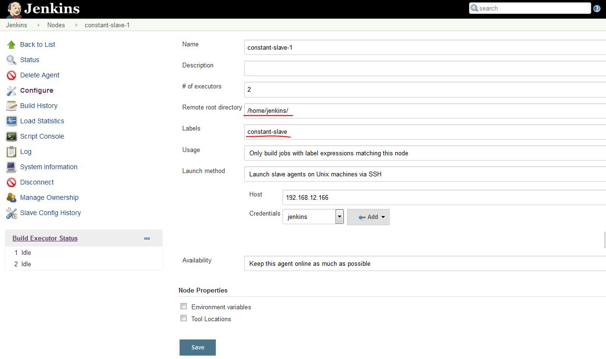

Add static slave node
=====================

* Log in Jenkins
* startup an instance(IP) in POD
* click <Manage Jenkins> => <Manage Nodes> => <New Node>
* give a new name for this slave node, selected "Permanent Agent", and "OK"
* give the work path in "Remote root directory".
  NOTE: the work path must be an existing dir
* **IMPORTANT** give the label for "Labels"(Label)
* select "Only build jobs with label expressions matching this node" for "Usage"
* select "Launch slave agents on Unix matchines via SSH" for "Launch method"

    * put the IP of instance (step 2) in "Host"
    * select "jenkins" for "Credentials"
* select "Keep this agent online as much as possible" for "Availability"

* click save

