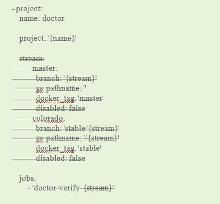
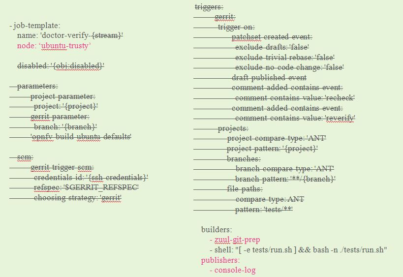

Translate OPNFV Releng jjb into OpenZero Releng jobs
============================================================

**Take Doctor for example**

To add OPNFV project jjb into openzero/releng, there are three
parts need to be modified.

* openzero/releng/jenkins/jobs/projects.yaml
* openzero/releng/jenkins/jobs/$YOUR_PROJECT.yaml
* (optional) openzero/releng/jenkins/scripts/$SCRIPT_NAME.yaml
* openzero/releng/zuul/layout.yaml

0. Prerequisites
----------------

* Git clone opnfv/releng repo and find the `doctor.yaml`

* Git clone the openzero/releng repo from internal gerrit
  server(opnfv.zte.com.cn/gerrit)

1. openzero/releng/jenkins/jobs/projects.yaml
---------------------------------------------

"projects.yaml" lists all of the job templates of each project.

Pls look at the following image.
After deleting the redundant lines, add the remaining lines into projects.yaml.

**NOTE** all of projects must be sorted alphabetically

2. openzero/releng/jenkins/jobs/$YOUR_PROJECT.yaml
---------------------------------------------------

"$YOUR_PROJECT.yaml" is described all of the job templates of
your project, such as doctor.

Pls look at the following image.
After deleting the redundant lines, add the remaining lines into "$YOUR_PROJECT.yaml".

* **node:'ubuntu-trusty'**

Assign a kind of Label to run job.

* **zuul-git-prep**

Git clone the newest codes of YOUR_PROJECT.

* **console-log**

Config log link.

3. (optional) openzero/releng/jenkins/scripts/$SCRIPT_NAME.yaml
------------------------------------------------------------

If the jobs of your project need to run some scripts, pls
put those scripts into 'openzero/releng/jenkins/scripts' dir.

4. openzero/releng/zuul/layout.yaml
--------------------------------

After the above operations, all of **jobs (not job template)**
of your project must be listed in layout.yaml.

::

  - name: openzero/doctor
    template:
      - name: merge-check
    check:
      - doctor-verify
    gate:
      - doctor-verify

* **name: openzero/doctor**

Consistent with the name of project in gerrit server.

* **name: merge-check**

Must be added, but there is no operation in it.

